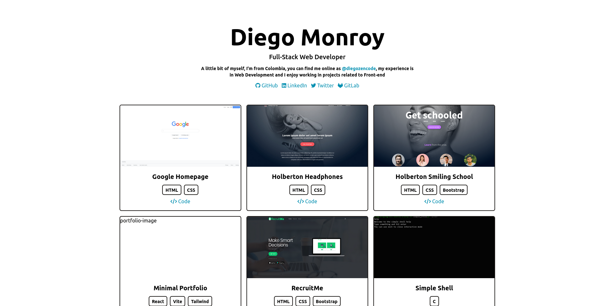

# My Portfolio

> Portfolio v2 2023

## Description

Build my own minimal portfolio using vite and react.

## Technologies & Tools 💻

| Category    | Technology/Tool                                                                                                                                                                                                                                                                                                                                                                                                                                                                                                                                                                                                                                                                                                                   |
| ----------- | --------------------------------------------------------------------------------------------------------------------------------------------------------------------------------------------------------------------------------------------------------------------------------------------------------------------------------------------------------------------------------------------------------------------------------------------------------------------------------------------------------------------------------------------------------------------------------------------------------------------------------------------------------------------------------------------------------------------------------- |
| `Frontend`  |      |
| `Utilities` |                                                                                                                                                                                                                                                                                                |
| `Editors`   |                                                                                                                                                                                                                                                                                                                                                                                                                                                                                                                                                            |

## Live demo

> Porfolio homepage.

[Live demo](https://portfoliov2-86i88.kinsta.page/)

---

## Project Notes

- Build with Vite, React, and Tailwindcss
- Minimal design
- Responsive
- Light and dark theme

---

## Author

- **Diego Monroy** (@diegozencode) -  |
   |
  
